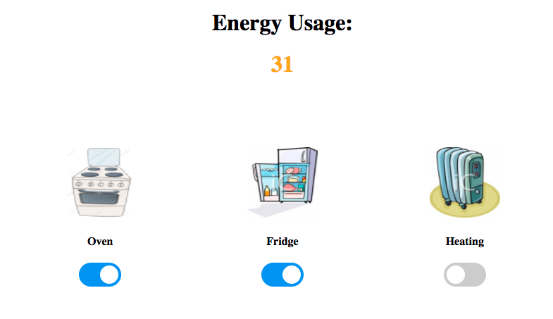

# Pure JavaScript Smart Meter Application

The app allows you to turn on and off your household electrical appliances each of which has a different energy usage.  When an electrical appliance is turned on the energy usage is show and updated every second.  The more appliances that are turned on, the higher the energy output.  The output is represented by a figure displayed in the browser window which is coloured green for low usage, orange for medium usage and red for high usage.

The app is written using the following technologies:

* JavaScript
* HTML
* CSS

Tested using:

* Jasmine

## Getting Started
* Clone this repository to your computer
* Using your command line navigate to the directory where you have saved the clone and type 'open index.html' which will open the application in your default browser.

## Running the tests
The app is test driven with Jasmine.  To run the test suite type the following in your command line from the app root directory: 'open jasmine/jasmine-standalone-2.6.0/SpecRunner.html'.  This will open up a window in your browser showing the result of the tests.

## Using the app
Simply switch appliances on and off using the appliances on/off switch and watch the energy usage increase.

## For the future...
I intend to develop the app in the future with the following features:

* Allow a user to add appliances
* Have the energy usage rating based on units of power used as apposed to how many appliances are switched on
* Increased functionality to the Smart Meter object:
  - record energy usage over a given period of time
  - allow for power saving
